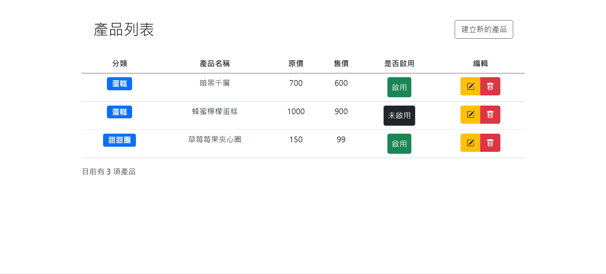

# Vue 作品實戰 2022 春季班 Week3 主線任務

## [Demo](https://sylvia-h.github.io/Hex_Vue_week3/)

## 專案重點

### 登入頁面

* 完成帳號密碼驗證後，將回傳的 token 以 cookie 形式儲存

### 後台產品列表

* 點擊「是否啟用」按鈕，可切換**產品狀態**（啟用/未啟用）

* 點擊**編輯**按鈕，會跳出 Bootstrap Modal 面板，顯示所點擊的產品細節內容，並可向後端傳送更新後的資料

* 點擊**刪除**按鈕，會跳出 Bootstrap Modal 面板，進行確認刪除所點擊的產品

* 點擊**建立新的產品**按鈕，會跳出 Bootstrap Modal 面板，建立新的產品資料

* 在建立新產品的面板中，有**圖檔上傳區**，可以上傳圖檔，並接收由後端回傳的雲端網址，且可點擊「複製」按鈕來複製圖檔位址。

## 使用技術與套件列表

* SCSS
* Bootstrap 5
* Vue.js
* axios
* sweetalert.js
* clipboard.js
